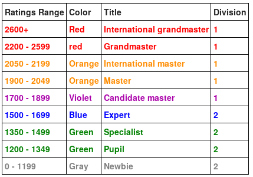

# Road to red coder

This is a repository that I use as diary to my journey from puppil to red coder at [CodeForces](codeforces.com). 

Wait, what? Codeforces? Red coder? Puppil? Okay, so Codeforces is a website that provides contest for competitive programing and it has a ranking based on [elo rating](https://en.wikipedia.org/wiki/Elo_rating_system).

> "When the contesters take part in Codeforces contest, they raise or lower their rating that reflects their ability to solve the tasks. The rating is a modification of Elo rating, several details can be read in a fuller form. According to the rating, the contestants are split into two divisions: the second one (the weaker one, amateurs) and the first one (the stronger one, pros). The contestants who don't take part in contests and those whose rating is below 1900 belong to the second division. The 1900+ rating means that you're part of the first division. Usually two types of contests are held on Codeforces: for the second division contestants (the first division contestants can take part there out of competition) and for both divisions. The first contest type contains simpler and learning-oriented tasks."
>
> -- <cite>[Codeforces help section](https://codeforces.com/help#q8)</cite>

At the following table it's possible to see the titles for each rating at the rakning:

## My goals

- [ ] Became a Specialist
- [ ] Became an Expert
- [ ] Became a Candidate master
- [ ] Enter the first division (get 1900+ at rating)
- [ ] Became Master
- [ ] Became an International master
- [ ] Win at least one T-shirt (some contest gives T-shirts for the top competitors)
- [ ] Became a red coder

## The process

- 2020/06/10 (First day) I started to do some basic problemset with dificuty 800 using C/C++, and read the book: Competitive Programmer’s Handbook by Antti Laaksonem. (30 minutes)

- 2020/06/11 Just solved some problems, getting used to C++.(60 minutes)

- 2020/06/12 I solved some problems, I feel that I'm searching too much how to handle string on C++, I'll focus one day of the next week on that. (30 minutes)

- 2020/06/13 I decided to be one of the participants of [Codeforces Round #649 (Div. 2)](https://codeforces.com/contest/1364) even knowing that I was not ready, I tried to implement a recurse logic for the problem A, but it was O(n^2) and I could't manage to pass some test cases on the time needed, durring this week I'll review how other people solved this problem. (120 minutes)