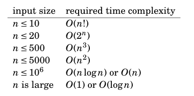

# Road to red coder

This is a repository that I use as diary to my journey from puppil to red coder at [CodeForces](codeforces.com). 

Wait, what? Codeforces? Red coder? Puppil? Okay, so Codeforces is a website that provides contest for competitive programing and it has a ranking based on [elo rating](https://en.wikipedia.org/wiki/Elo_rating_system).

> "When the contesters take part in Codeforces contest, they raise or lower their rating that reflects their ability to solve the tasks. The rating is a modification of Elo rating, several details can be read in a fuller form. According to the rating, the contestants are split into two divisions: the second one (the weaker one, amateurs) and the first one (the stronger one, pros). The contestants who don't take part in contests and those whose rating is below 1900 belong to the second division. The 1900+ rating means that you're part of the first division. Usually two types of contests are held on Codeforces: for the second division contestants (the first division contestants can take part there out of competition) and for both divisions. The first contest type contains simpler and learning-oriented tasks."
>
> -- <cite>[Codeforces help section](https://codeforces.com/help#q8)</cite>

At the following table it's possible to see the titles for each rating at the rakning:

## My goals

- [ ] Became a Specialist
- [ ] Became an Expert
- [ ] Became a Candidate master
- [ ] Enter the first division (get 1900+ at rating)
- [ ] Became Master
- [ ] Became an International master
- [ ] Win at least one T-shirt (some contest gives T-shirts for the top competitors)
- [ ] Became a red coder

## The process

- 2020/06/10 (First day) (30 minutes) I started to do some basic problemset with difficulty 800 using C/C++, and read the book: Competitive Programmer’s Handbook by Antti Laaksonem. 

- 2020/06/11 (60 minutes) Just solved some problems, getting used to C++.

- 2020/06/12 (30 minutes) I solved some problems, I feel that I'm searching too much how to handle string on C++, I'll focus one day of the next week on that. 

- 2020/06/13 (135 minutes) I decided to be one of the participants of [Codeforces Round #649 (Div. 2)](https://codeforces.com/contest/1364) even knowing that I was not ready, I tried to implement a recursive logic for the problem A, but it was O(n^2) and I couldn't manage to pass some test cases on the time needed, during this week I'll review how other people solved this problem. **Update**:  After the contest I was thinking too much on the first problem and then I decided to read the editorial, my first thought was really close, I don't know why I've abandoned it, but at least now I managed to implement a solution that is O(n).

- 2020/06/14  (something around 120 minutes) I've invested some time watching the weekly video from [programmation club of UTFPR](http://cdp.dainf.ct.utfpr.edu.br/), it was really long and I don't like that much learn as a passive listener, but it gave me some topics that I need to study, because of that I'm not sure if it's worth it to keep following. With that said I want to study some topics on next week:
    1. Read about strings on C++, sometimes I know what I need to do, but I'm losing too much time search trivial stuffs like "compare strings".
    2. Read and do some exercices related with DFS, it looks pretty simple but I never study it.
    3. Read, do some exercices and try to search some applications for segment trees.
    4. Solve the problem [Grand Prix da Nlogônia](https://olimpiada.ic.unicamp.br/pratique/p2/2019/f3/prix/) from UBI19 it's a problem that uses knowledge from DFS and segment trees, showed on the programmation club last week.
 
 - 2020/06/15 (60 minutes) I've spent some time doing other exercice from [programmation club of UTFPR](http://cdp.dainf.ct.utfpr.edu.br/), it looks like an linked list but I'm not sure what I'm doing wrong, I'll watch the second part of the video, and then continue with my normal study flow, I still have some doubts about this club and the invested time on it.

 - 2020/06/17 (45 minutes) For now I decided to do some codeforces problemset during the week when I have a lower amount of time, and during the weekend I'll give a chance to the [programmation club of UTFPR](http://cdp.dainf.ct.utfpr.edu.br/), today I just made some problems and most of then was related with string I still don't feel confident with that, but at least I'm getting some experience.

 - 2020/06/18 (45 minutes) Today I continued doing some easy problems on codeforces (dificulty 800), I've solved 5 exercices in 45 minutes so probably this dificulty is too low, I only had to think about one problem that I noticed that was a arithmetic progression, and I wasn't able to remember the closed form of the sum of it, but I searched it and solved the problem. Tomorrow I'll try to get this formula from my head on my lunch time at work. Today I also noticed that the book I was reading has all the content that I've saw on [programmation club of UTFPR](http://cdp.dainf.ct.utfpr.edu.br/) and since I learn better by myself I'll just focus on increase my skill doing problems and reading this book, following the rule of 5% (5% of my time training will be reading). Tomorrow I'll start problems with dificulty 900.

 - 2020/06/22 (60 minutes) I started to do some exercices with dificulty 900, most of then was pretty easy, but the last one took something around 15 minutes, I managed to do it, but after it I saw some orange guys solution and it was really smaller, IDK if I should care about it already. Besides that last days I didn't found time to train last days, but at least I've read a litle bit and the book showed a table that is really useful it shows a estimation between the input size and the required time complexity.

 